**CCT College Dublin Continuous Assessment**

### Learning Outcomes:

This CA will assess student attainment of the following minimum intended learning outcomes: 

#### Big Data Storage and Processing MLOs
- Critically assess the data storage and management requirements of a given data project from a modern perspective and evaluate limitations of legacy approaches to Big Data. (Linked to PLO 3)
- Assess the design concepts and architectural patterns of distributed Big Data systems and analyse the components that form their technology stack. (Linked to PLO 1, PLO 2)
- Critically evaluate and select a Big data environment suitable for retrieving and processing a given Big Data set, perform data management and select appropriate analytic algorithms for the required scale and speed. (Linked to PLO 2, PLO 3)

#### Advanced Data Analytics MLOs
- Debate the theory and application of different types of neural networks. (Linked to PLO 1, PLO 2)
- Analyse a set of requirements to determine the type of Neural Network for a particular problem set. Document and justify the choices made to stakeholders and peers through insight gained from the process. (Linked to PLO 4, PLO 5)

### Attainment of Learning Outcomes

Attainment of the learning outcomes is the minimum requirement to achieve a Pass mark (40%). Higher marks are awarded where there is evidence of achievement beyond this in accordance with QQI Assessment and Standards Revised 2013 and summarised in the following table:

| Percentage Range | QQI Description of Attainment          |
|------------------|----------------------------------------|
| 70% +            | Achievement includes that required for a Pass and in most respects is significantly and consistently beyond this |
| 60 – 69%         | Achievement includes that required for a Pass and in many respects is significantly beyond this  |
| 40 – 59%         | Attains all the minimum intended programme learning outcomes   |
| 35 – 39%         | Nearly (but not quite) attains the relevant minimum intended learning outcomes  |
| 0 – 34%          | Does not attain some or all of the minimum intended learning outcomes  |

The CCT Grade Descriptor describes the standard of work for grade boundaries summarised below. The full descriptor is available on Moodle.  

| Grade          | Performance    |
|----------------|----------------|
| 90-100%        | Exceptional    |
| 80-89%         | Outstanding    |
| 70-79%         | Excellent      |
| 60-69%         | Very Good      |
| 50-59%         | Good           |
| 40-49%         | Acceptable     |
| 35-39%         | Fail           |
| <35%           | Fail           |

### Assessment Task

Note your chosen topic of research cannot be the same as your topic chosen for your RP&E Module

#### Acceptable and Unacceptable Use of AI

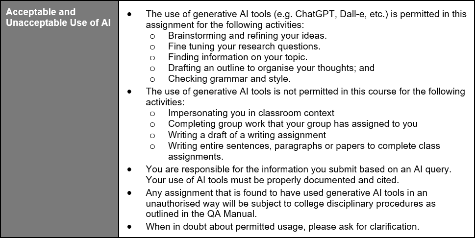

**Note:** ALL Students are required to use Git for any Assignments that they are working on. This means that ALL changes must be committed to Git during your assignment. (Not just a single commit at the end!) This is to allow you to display your incremental progress throughout the assessments, give you practice for your capstone/thesis, allow you to create an online portfolio that can be used to showcase your work, and to ensure that there are no problems with final uploads (as all your work will be available on GitHub). It is expected that there will be a minimum of 10 commits (with many of you making very many more).

You may only use your CCT email for your git account; private/work email-based accounts will not be accepted. You must also include your lecturer's CCT email as a collaborator on your account.

Students are advised to review and adhere to the submission requirements documented after the assessment task. 

### Assessment Task Description

In this continuous assessment, you are expected to carry out research and produce a research paper based on your chosen topic combining Advanced data analytics (specifically Neural Networks) and Big Data Storage & Processing. Some example topics of interest include but are not limited to:
- Deep Learning using Big Data 
- Big data architectures that incorporate Neural Networks 
- Programming paradigms for Data Analytics 
- Data streaming / encoding / compression 
- Algorithms for parallel and distributed computing incorporating Neural Networks 
- Application of distributed computing and Neural Networks for specific domains / problem areas / use cases 
- Data Lakes/Prompt Engineering/Large Language Models

The rationale behind this continuous assessment is to practice your critical evaluation skills based on the state of the art in regard to your chosen area of interest. Note that critical evaluation doesn’t necessarily imply a negative evaluation of a work but it is your structured methodological review of its contributions as well as limitations.

#### Technical Demonstration:
Demonstrate a practical example of your chosen area of interest that should include Big Data and Advanced Data Analytics.  
This will be a coded example and will require you to upload your code in a Jupyter notebook.  
Demonstrate your research along with your practical deployment using a video recording (5 – 7 minutes) or Screencast. [0 - 20]  

#### Your paper should include: 
- Overview of the chosen topic including objective statement and Research Question. Presentation of state of the art including research methodologies and key findings of the papers you reviewed. [0 - 20] 
- Literature review based on the chosen papers for the topic of your choice including proper citations and Harvard style referencing. [0 - 15] 
- Critical evaluation of the key findings, specifically their implications and limitations, and highlighting any contradicting viewpoints and research gaps. [0 - 30] 
- Conclusions you have drawn based on your research. [0 - 15]

Grades will be dependent upon your work on BOTH Advanced data analytics (specifically Neural Networks) and Big Data Storage & Processing. For example, if you only complete your assignment on Big Data with no Advanced data Analytics, then you would receive a grade for the Big Data Module and a 0 for Advanced data Analytics. It is important to remember that a research paper is not just a summary of articles. 

The expected word count should be 4000 – 6000 (excluding references, titles, citations, and quotes) in length and should follow the IEEE format. You should draw on appropriate academic literature for your review (use a MINIMUM of 10 references). Tools like Google Scholar will be of key value to achieve this. Moreover, tools such as Zotero or Mendeley will be very useful for reference management and proper reference formatting. [Ignore private information in the IEEE template except StudentID, Name, Course]

#### Submission:
The final report must be submitted to Moodle on/before the deadline. Submissions received after the deadline will be subject to penalties.  
Format of word file name should follow the format studentID_Integrated_CA (NO PDFs!)  
- Code files (Jupyter notebook) 
- Screencast presentation
- Data sets 
- GitHub link

#### Submission Requirements
All assessment submissions must meet the minimum requirements listed below. Failure to do so may have implications for the mark awarded.   
All assessment submissions must:
- 4000 - 6000 words (excluding references, titles, citations, and quotes)
- Word Document for report 
- Jupyter notebook for code 
- Screencast for practical demonstration
- IEEE Format 
- Be submitted by the deadline date specified or be subject to late submission penalties 
- Be submitted via Moodle upload 
- Use Harvard Referencing when citing third party material  
- Be the student’s own work.  
- Include the CCT assessment cover page.   

#### Additional Information
- Lecturers are not required to review draft assessment submissions.  
- In accordance with CCT policy, feedback to learners may be provided in written, audio, or video format and can be provided as individual learner feedback, small group feedback, or whole class feedback.  
- Results and feedback will only be issued when assessments have been marked and moderated/reviewed by a second examiner.  
- Additional feedback may be requested by contacting your lecturer AFTER the publication of results. Additional feedback may be provided as individual, small group, or whole class feedback. Lecturers are not obliged to respond to email requests for additional feedback where this is not the specified process or to respond to further requests for feedback following the additional feedback.  
- Following receipt of feedback where a student believes there has been an error in the marks or feedback received, they should avail of the recheck and review process and should not attempt to get a revised mark/feedback by directly approaching the lecturer. Lecturers are not authorised to amend published marks outside of the recheck and review process or the Board of Examiners process.  
- Students are advised that disagreement with an academic judgement is not grounds for review.
- For additional support with academic writing and referencing, students are advised to contact the CCT Library Service or access the Essentials Modules in Moodle. 
- For additional support with subject matter content, students are advised to contact the CCT Student Mentoring Academy.
- For additional support with IT subject content, students are advised to access the CCT Support Hub.

__________________________________________________________________________________________________________________________________________________________________________

# Commencement of First Assignment for Semester Two
__________________________________________________________________________________________________________________________________________________________________________

# Title
**Storage Solutions and Data Analytics: RDBMS, Hadoop and APIs in Neural Networks Contexts**

# Details

**MSc in Data Analytics (SB+) - Sept 2023 - 2024 - YR1**

Author: Jose Maria Rico Leal

e-mail: sba23021@student.cct.ie

Student ID: sba23021

GitHub Link:
https://github.com/JoseRicoCct/CA1_Integrated_Assesment_MSc_Data_Analytics_CCT_Semester_2

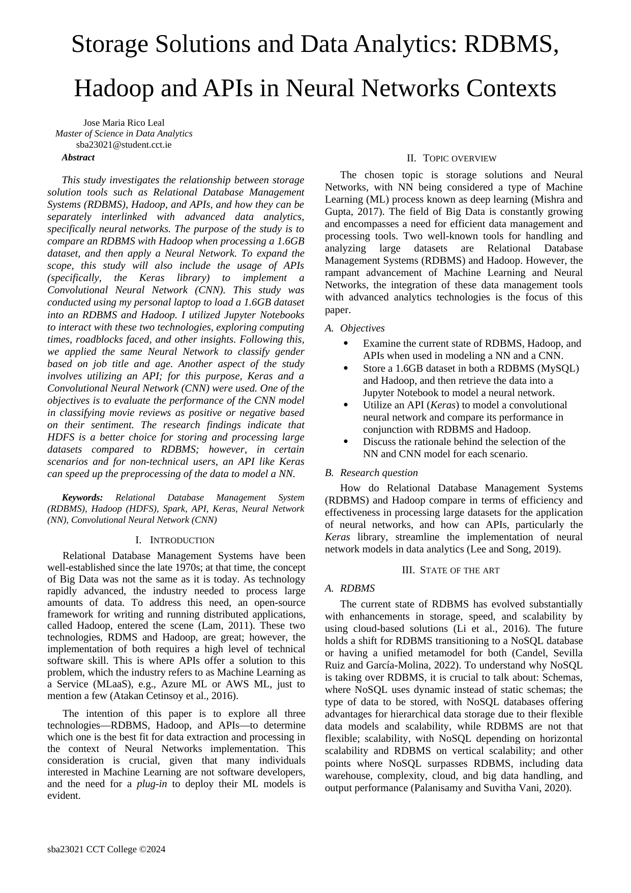

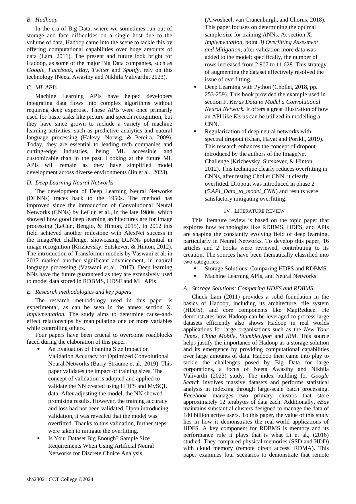

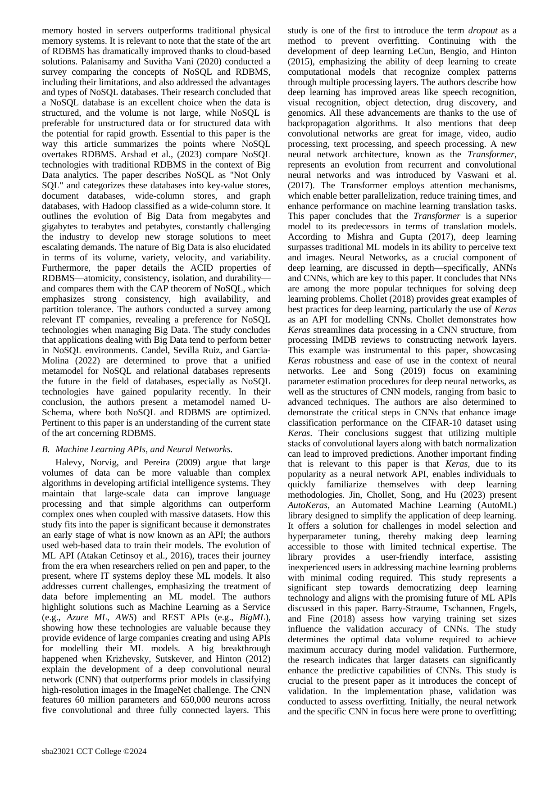

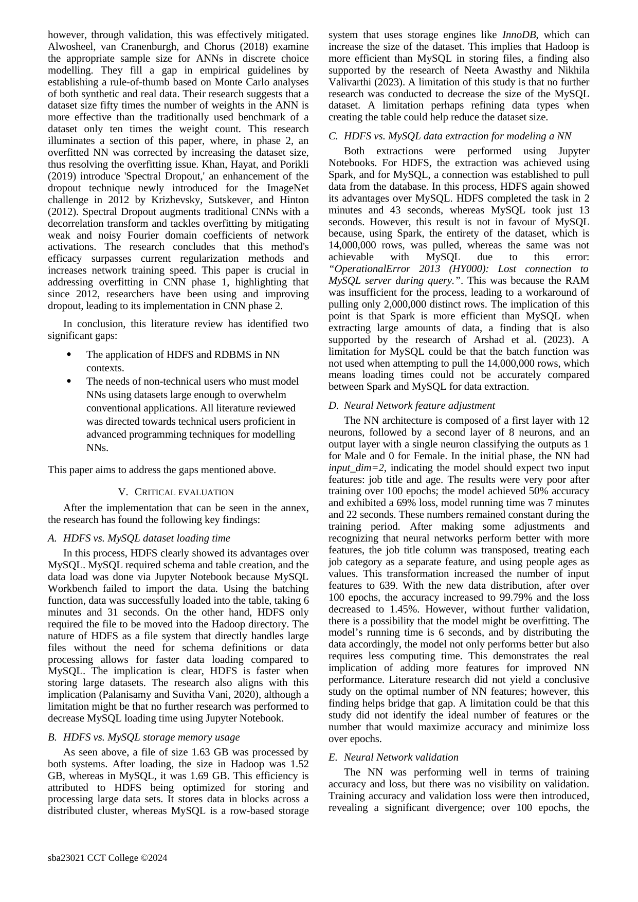

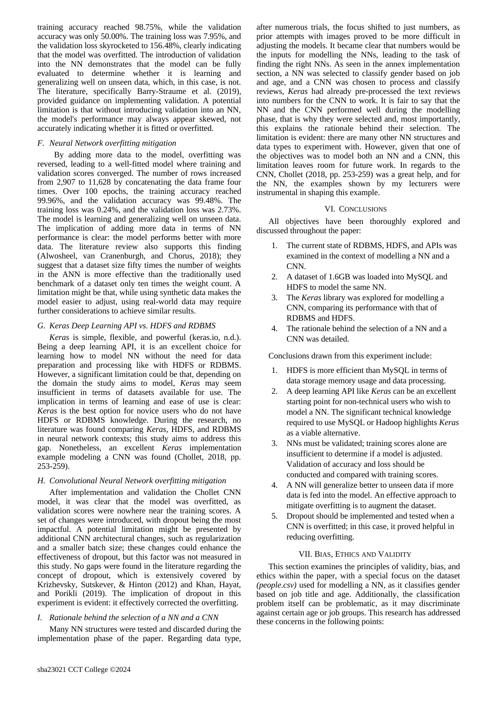

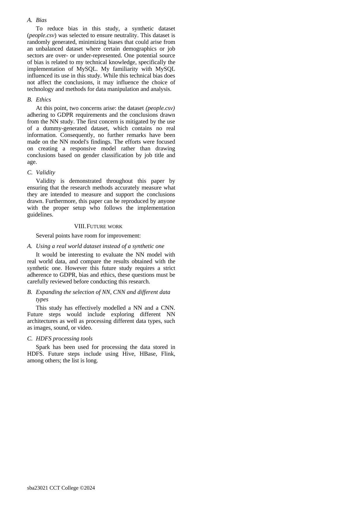

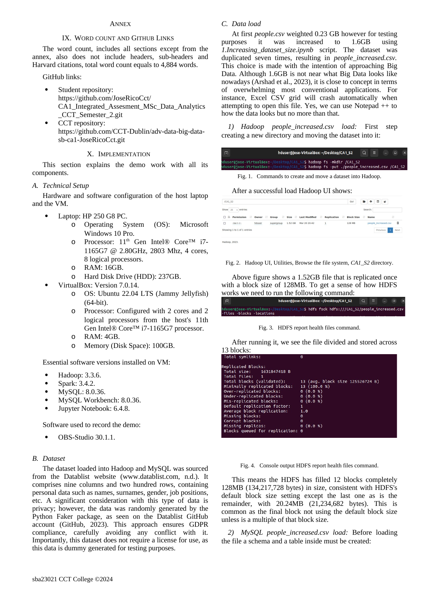

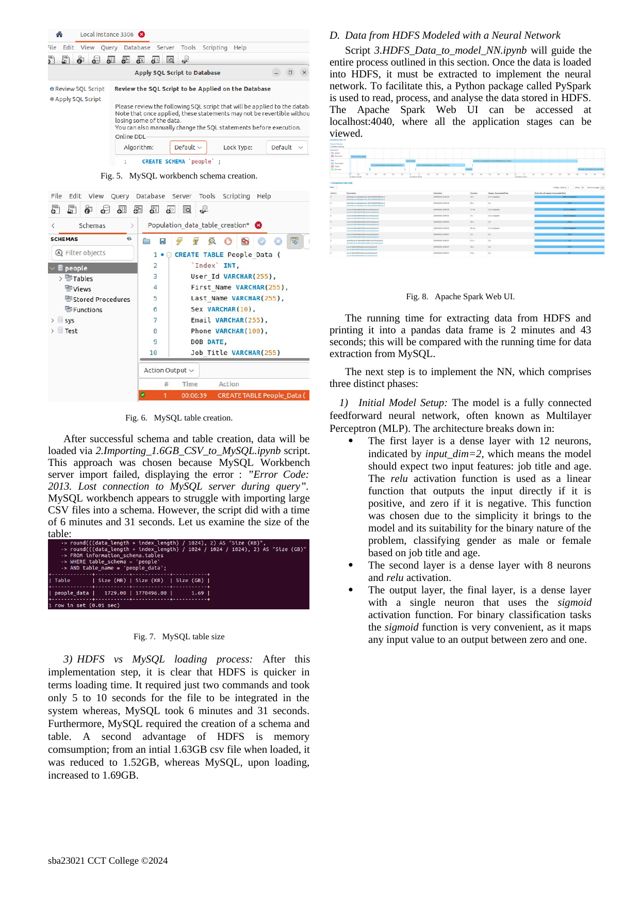

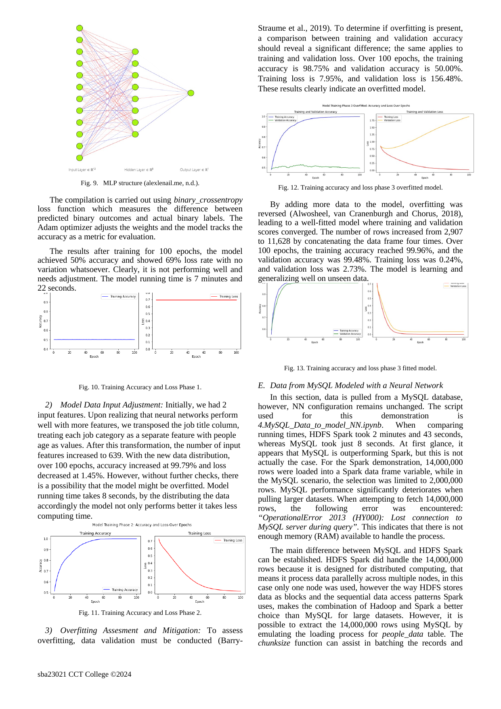

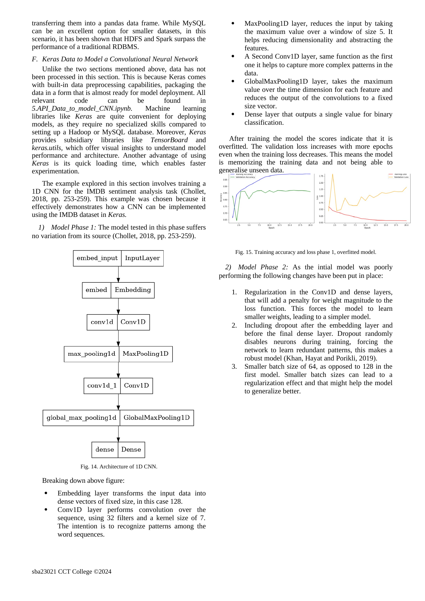

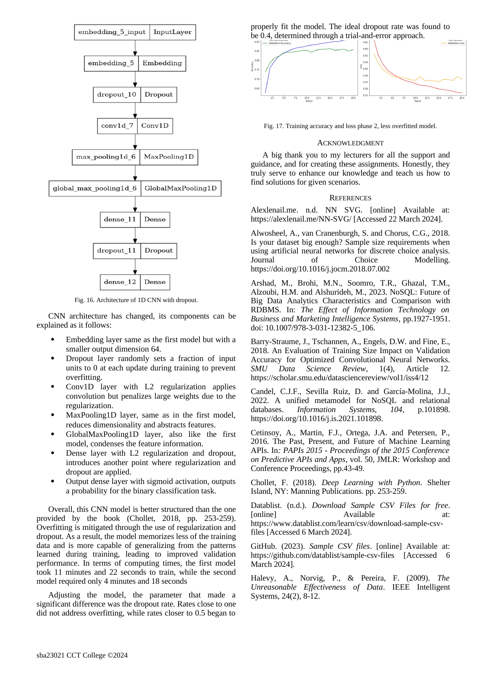

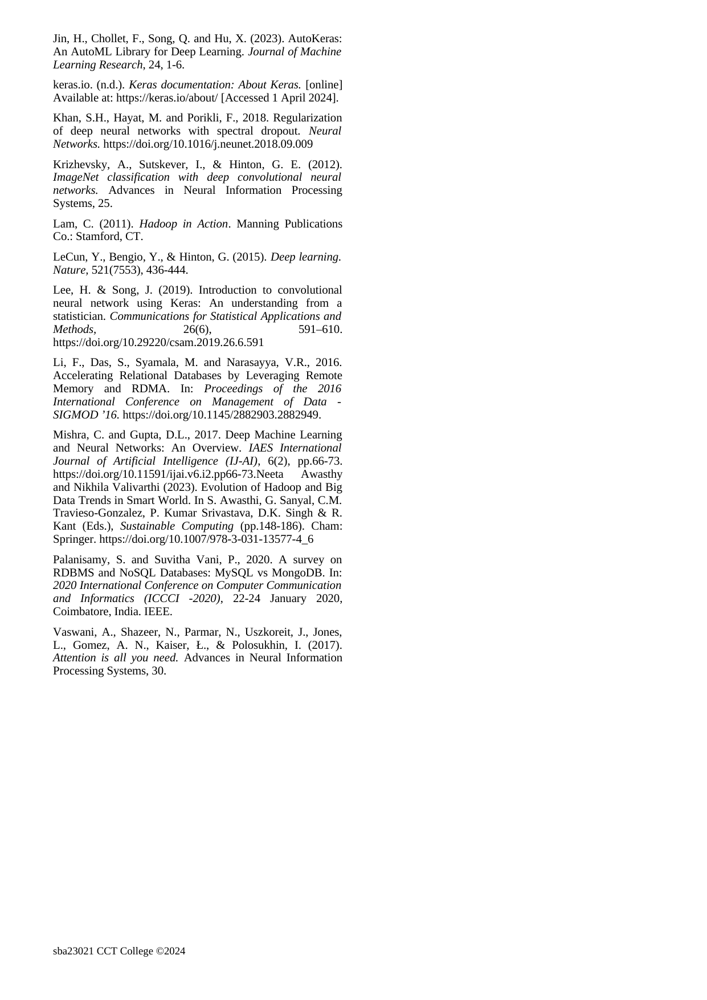

## License

Copyright (c) 2024 josericodata. This project is made available under the MIT License - see the [LICENSE](LICENSE) file for more details. 